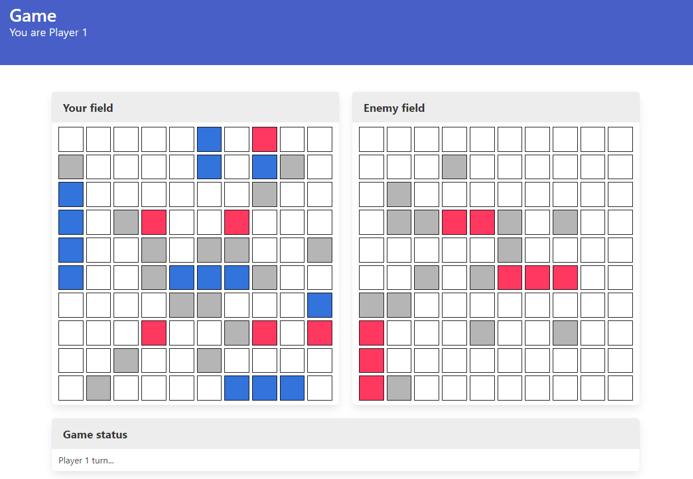
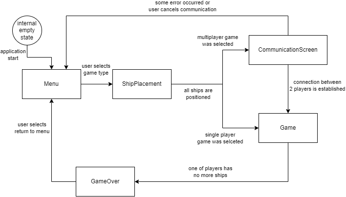
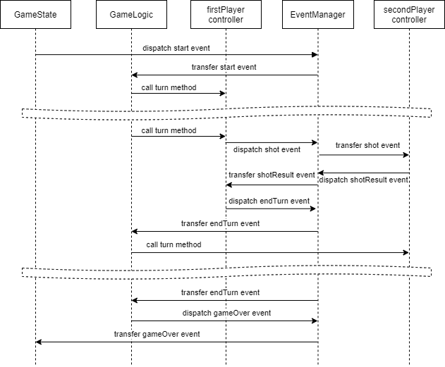

Sea battle
===
Simple sea battle game - [Play](https://mhz-edu.github.io/sea-battle/)

## Description

Yet another implementation of a classic tabletop game. Each of two players has a 10x10 field and 10 ships of different sizes.
Players must place their ships on the field either horizontally or vertically and so that there is always at least one empty cell between them.
After ships are ready, players start to exchange shots. Goal is to hit all enemy ships.

Current implementation could be played in single player mode with a dummy bot and in multiplayer mode with another player on his machine.

## Technical details

Game is written in vanilla JS without using any frameworks or libraries. Except for the multiplayer part where the underlying p2p connection is handled by the Peer.js library.

Game is represented as a simple state machine implemented in the `StateMachine` class. Game states are implemented as separate classes with `enter` and `exit` methods. State diagram is shown below.

Game itself is implemented as message exchange through the `EventManager` object between player controllers governed by the `GameLogic` object. Sequence diagram below that depicts game start, ingame and game over exchange.

Multiplayer game is using the Peer.JS library to establish a connection and to send messages between two peers. Froma a game mechanics standpoint, in case of multiplayer, a simple `NetworkPlayer` object is used. It relays messages from `EventManager` to another peer and back.

## Things to improve

Of course, there are plenty of items that could be improved. 

1. Code and layout are too tightly coupled. It is difficult to change layout without changes in state code.
2. Data structure for the game field could be improved. Like to add getters and setters for given rows and columns.
3. Add some kind of reactivity to elements. As Example, if the game field has been changed, respective UI elements should be rerendered automatically.
4. UI/UX of ship placement. For now there is now way to adjust an already placed ship without clearing the whole game field.
5. Tests...

## Reference

I've intentionally avoided checking existing solutions to practice problem solving. However I used the following materials for help and insights.

1. [MDN Web Docs](https://developer.mozilla.org/)
2. [CS50's Introduction to Game Development](https://cs50.harvard.edu/games/) - Lectures 0 and 1 in particular about state machines. (Also they are not using JS there)
3. [MVC Game Design Pattern](https://github.com/wesleywerner/mvc-game-design) and it's [predecessor](http://ezide.com/games/writing-games.html) - On how to structure games and Event manager approach (Also non-JS specific)
4. [PeerJS docs](https://peerjs.com/docs/#api)
